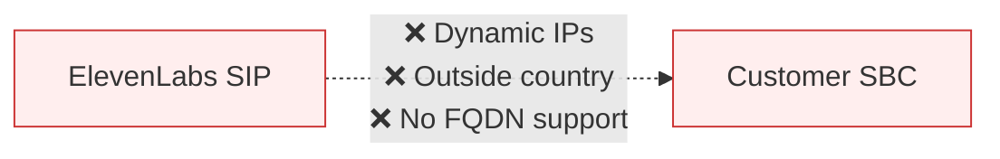
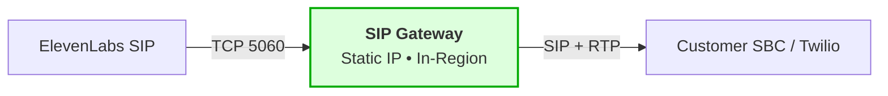
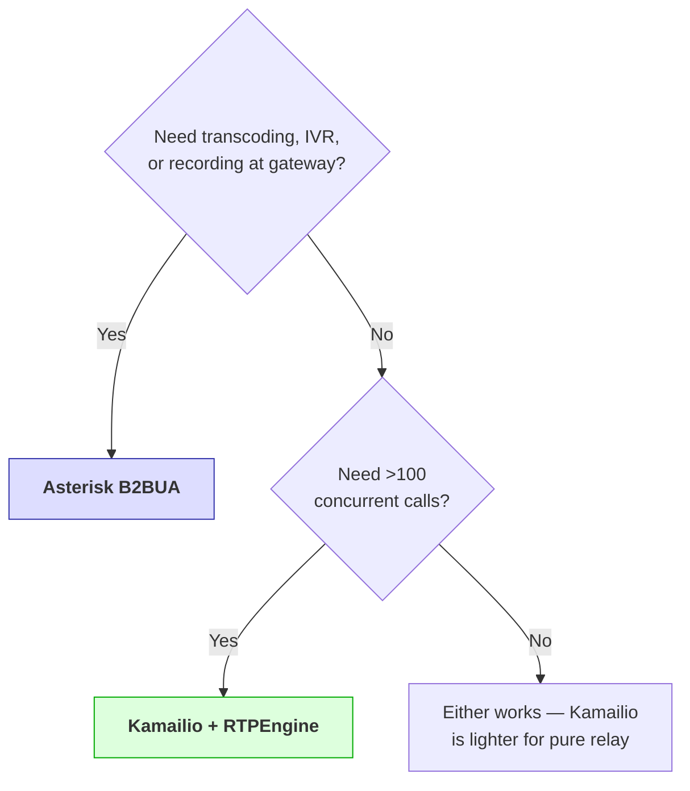
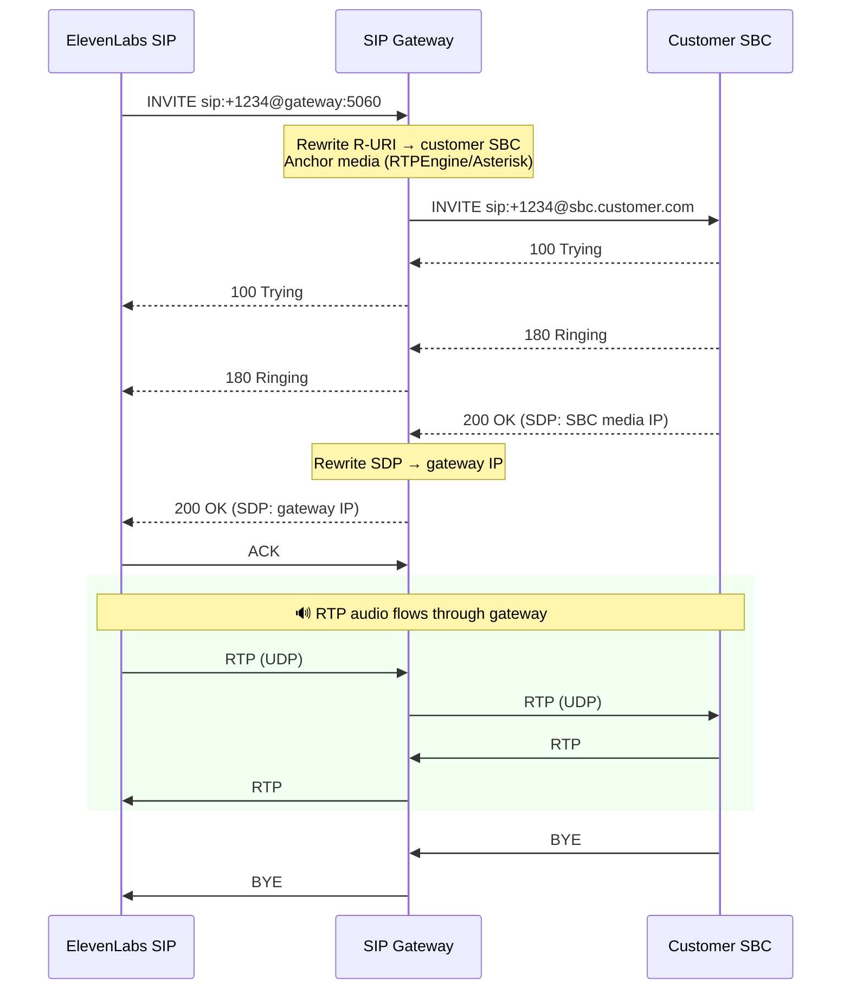

<p align="center">
  
</p>

<h1 align="center">SIP Gateway</h1>

<p align="center">
  Regional SIP gateway between ElevenLabs and customer SBCs — static IP, in-country presence, media anchoring.
</p>

<p align="center">
  <a href="#quick-start"></a>
  
  = 1.5" />
  = 24.0" />
  
  
  
</p>

---

## Problem



| Issue | Impact |
|-------|--------|
| SIP server IPs are dynamic | Legacy SBCs (Five9, etc.) can't whitelist |
| SIP INVITE originates outside country | Blocked by local telecom regulators (e.g., Turkey) |
| SBC requires IP, not FQDN | Direct connection impossible |

## Solution



Deploy a lightweight SIP gateway in any region. It provides a **fixed IP**, **in-country presence**, and **media anchoring** — all RTP audio flows through it.

---

## Two Approaches

<table>
<tr>
<td width="50%" valign="top">

### 🔹 [Kamailio + RTPEngine](./kamailio-proxy/)

**Stateful SIP proxy** with dedicated media relay.

- ~2ms overhead per call
- ~1000+ concurrent calls
- Automatic header passthrough
- Zero-copy RTP forwarding
- **Best for:** production, high scale, transparent relay

</td>
<td width="50%" valign="top">

### 🔸 [Asterisk B2BUA](./asterisk-b2bua/)

**Full Back-to-Back User Agent** (PBX engine).

- Full codec transcoding support
- IVR, DTMF, call recording at the gateway
- Asterisk dialplan flexibility
- **Best for:** PoC, when you need call logic at the edge

</td>
</tr>
</table>

For an **end-to-end home lab** (ElevenLabs → Kamailio + RTPEngine → Asterisk → mobile softphone), use the [poc](./poc/) stack and [poc/README.md](./poc/README.md).

For a **fully standalone Asterisk SIP server** (no Kamailio/RTPEngine dependency), use [asterisk-standalone](./asterisk-standalone/).

### Comparison

| | Kamailio + RTPEngine | Asterisk B2BUA |
|---|:---:|:---:|
| **Latency** | ~2ms | ~10-20ms |
| **Max concurrent calls** | 1000+ | 50-100 |
| **Header passthrough** | Automatic | Explicit mapping |
| **Codec transcoding** | ✗ | ✓ |
| **IVR / call logic** | ✗ | ✓ |
| **SIP dialog** | Preserved (proxy) | Re-originated (B2BUA) |
| **Config complexity** | ~150 lines | ~200 lines |

### Which one?



---

## Call Flow



---

## Quick Start

### GCP Deployment

<details>
<summary><b>Kamailio + RTPEngine</b></summary>

```bash
cd kamailio-proxy/terraform
cp terraform.tfvars.example terraform.tfvars
# Edit region, zone, project

terraform init && terraform apply

cd ../scripts
./deploy.sh --customer-sbc your-trunk.pstn.twilio.com
```

</details>

<details>
<summary><b>Asterisk B2BUA</b></summary>

```bash
cd asterisk-b2bua
PROJECT_ID=your-project \
TWILIO_TERMINATION_HOST="your-trunk.pstn.twilio.com" \
bash deploy-gcp-middleware.sh
```

</details>

### On-Prem / Non-GCP (Turkey, etc.)

<details>
<summary><b>Kamailio + RTPEngine</b></summary>

```bash
sudo bash kamailio-proxy/scripts/install-onprem.sh \
    --external-ip <PUBLIC_IP> \
    --internal-ip <PRIVATE_IP> \
    --customer-sbc your-trunk.pstn.twilio.com
```

</details>

<details>
<summary><b>Asterisk B2BUA</b></summary>

```bash
sudo bash asterisk-b2bua/install-onprem.sh \
    --twilio-termination-host your-trunk.pstn.twilio.com \
    --external-ip <PUBLIC_IP>
```

</details>

Both scripts install Docker, write all configs, open firewall ports, and start the stack.

---

## ElevenLabs Configuration

After deploying, configure the outbound trunk:

| Field | Value |
|-------|-------|
| **Address** | `<gateway-ip>` |
| **Transport** | TCP |
| **Auth** | Username/password (if enabled) |

## Twilio Elastic SIP

| Direction | Configuration |
|-----------|---------------|
| **Termination** (outbound) | Add `<gateway-ip>/32` to IP Access Control List |
| **Origination** (inbound) | Add URI `sip:<gateway-ip>:5060;transport=tcp` |

---

## Requirements

| Resource | Minimum |
|----------|---------|
| **OS** | Ubuntu 22.04+, Debian 12+, CentOS 8+ |
| **CPU** | 2 cores |
| **RAM** | 2 GB |
| **Ports** | TCP 5060, UDP 5060, UDP 10000-20000 |
| **IP** | Static public IP (or NAT with port forwarding) |

---

## Project Structure

```
sip-gateway/
├── asterisk-standalone/         # Independent Asterisk SIP server (Docker)
│   ├── README.md
│   └── docker-compose.yml
├── poc/                         # ElevenLabs → gateway → Asterisk → softphone (local POC)
│   ├── README.md
│   └── docker-compose.yml
├── kamailio-proxy/              # Kamailio + RTPEngine
│   ├── docker/                  #   Docker Compose stack
│   ├── terraform/               #   GCP infrastructure
│   ├── scripts/                 #   Deploy + on-prem installer
│   └── README.md
├── asterisk-b2bua/              # Asterisk B2BUA
│   ├── deploy-gcp-middleware.sh #   GCP provisioning
│   ├── install-onprem.sh        #   On-prem installer
│   ├── startup-script.sh        #   VM bootstrap
│   └── README.md
└── README.md                    # This file
```
---

## License

MIT

---

<p align="center">
  <sub>Built for <a href="https://elevenlabs.io">ElevenLabs</a> Conversational AI telephony</sub>
</p>
